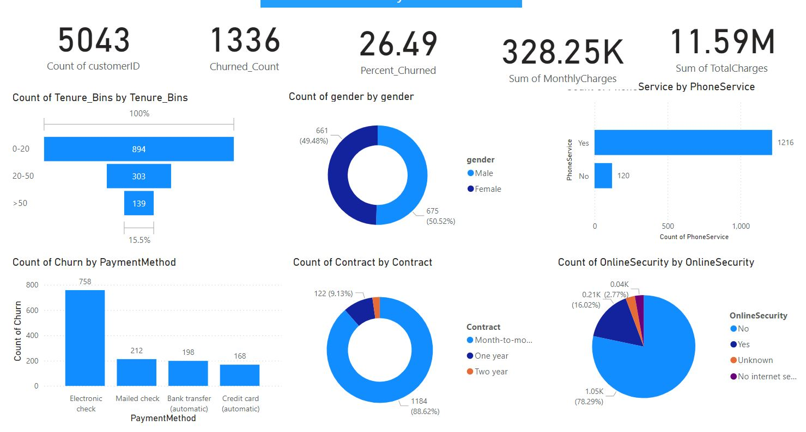

# Machine Learning Prediction Model for a Telecommunications Provider

## Business Understanding

##### **Project Background:** 
In the ever-evolving telecommunication sector, retaining customers and accurately forecasting churn is essential for sustaining growth and profitability, and these is can be achieved through the use of historical data. 

##### **The Goal:** 
This project seeks to harness binary classification models to deliver a thorough understanding of customer behaviour by using existing data to predict whether a customer will churn or not.

##### **Project Objectives:**
- Develop and train four baseline Machine Learning models on the provided dataset to predict customer churn

- Evaluate the models performance on existing data via the following metrics: accuracy, recall, precision, f1 and ROC to identify the most promising models for further improvement

- Fine-tune the models to optimize performance

- Provide Business Impact Assessment and Documentation of the Models

Through this initiative, the telecommunication company will gain a deeper, data-driven understanding of its customer base, enabling more effective decision-making to enhance customer loyalty and drive sustained business success.
 
##### **Stakeholders:**
- Telecommunication Services provider

##### **Key metrics and success Criteria:**
- Model should have accuracy scores of 85% (on balance data)
- Good models are expected to have an F1 score of > 80%
- An ROC Curve of 80% is ideal for the model to generalise well
- There should be a minimum of 4 Baseline models
- All hyperparameter tuning should only be applied to the Baseline models if they exceed their F1 score

##### **Features/Columns:**

- Gender -- Whether the customer is a male or a female

- SeniorCitizen -- Whether a customer is a senior citizen or not

- Partner -- Whether the customer has a partner or not (Yes, No)

- Dependents -- Whether the customer has dependents or not (Yes, No)

- Tenure -- Number of months the customer has stayed with the company

- Phone Service -- Whether the customer has a phone service or not (Yes, No)

- MultipleLines -- Whether the customer has multiple lines or not

- InternetService -- Customer's internet service provider (DSL, Fiber Optic, No)

- OnlineSecurity -- Whether the customer has online security or not (Yes, No, No Internet)

- OnlineBackup -- Whether the customer has online backup or not (Yes, No, No Internet)

- DeviceProtection -- Whether the customer has device protection or not (Yes, No, No internet service)

- TechSupport -- Whether the customer has tech support or not (Yes, No, No internet)

- StreamingTV -- Whether the customer has streaming TV or not (Yes, No, No internet service)

- StreamingMovies -- Whether the customer has streaming movies or not (Yes, No, No Internet service)

- Contract -- The contract term of the customer (Month-to-Month, One year, Two year)

- PaperlessBilling -- Whether the customer has paperless billing or not (Yes, No)

- Payment Method -- The customer's payment method (Electronic check, mailed check, Bank transfer(automatic), Credit card(automatic))

- MonthlyCharges -- The amount charged to the customer monthly

- TotalCharges -- The total amount charged to the customer

- Churn -- Whether the customer churned or not (Yes or No)

##### **Hypothesis:** 

**Null Hypothesis (H0):**
- There is no statistical significant relationship between churn rate and the contract term of the customer.

**Alternate Hypothesis (H1):**
- There is a statistical significance relationship between churn rate and the contract term of the customer. The test was performed using the Chi-Square Test of Independence since the variables are categorical.

## Data Understanding

The project was initialized with the following libraries:
- Data manipulation: NumPy, pandas
- Statistical analysis: SciPy
- Data visualisation : Matplotlib, Seaborn, Plotly
- Machine learning and Evaluation methods : Sklearn, imblearn

The task involves accessing three different datasets from different sources:
- Remote database
- GitHub repository
- OneDrive

A cursory appraisal of the dataset revealed that both training and evaluation sets had similar features and hence were concatenated for Exploratary Data Analysis(EDA).

### **Exploratory Data Analysis (EDA)**
This phase involved an in depth inspection of the datasets, its visualisation to answer analytical questions and planning of the cleaning, processing and feature creation.

- **Data Quality Assessment (info, duplicates, null values, describe etc.)**

Observations:
- There were six(6) columns containing over 12% of missing values with one other column containing 5.3%.
- There are no duplicated values in the concatenated dataframe
- A view of the unique values of the columns indicates irregular boolean data types ie:('PhoneService') has 4 unique values (False, True, 'Yes' 'No')
- The features of the dataframe could be grouped for ease analysis

Actions:
- Created and applied a standardization function to map the irregular boolean data types into appropriate forms.
- Segmented the features of the dataframe into the following:
  1. target = Churn (The target variable)
  2. subscriber_account_numerical = (tenure, MonthlyCharges, TotalCharges)
  3. subscriber_account_categorical = (Contract, PaperlessBilling, PaymentMethod, customerID)
  4. subscriber_demographic = (gender, Partner, SeniorCitizen, Dependents)
  5. subscribtions = (PhoneService, MultipleLines, InternetService, OnlineSecurity, OnlineBackup, DeviceProtection, TechSupport, StreamingTV, StreamingMovies)

- **Data exploration**

The summary of the descriptive are as follows:
1. Tenure: The average duration subscribers stay with the company was 32.58 months, with a minimum of zero and a maximum of 72 months (6 years) but a standard deviation of 24.53 suggest some amount of variation between subscribers duartion with the firm.
2. MonthlyCharges: The maximum monthly charge of 118.65 and a minimum of 18.40 with the standard deviation indicate variability of monthly charges for subscribers.
3. TotalCharges: The average total charges (2302.06) exceeds the median (1401.15), indicating a presence of higher charges from a smaller group of customers.

The distribution of the dataset revealed the following:
1. The features are not normally distributed with skewness detected
2. Dataset is not balanced
3. Little or no visible outliers
4. The Tenure feature has a biomodal distribution

Business Insights

- The distributions above suggests two broad customer segments

- **Data Analysis**

This phase relied on probing analytical business questions with corresponding visualization to provide insight into the structure and patterns of potential causes of Churn, splitted into questions without feature engineering and those with feature engineering.

- Analytical Questions with Feature Engineering
1. What is the churn rate for customers with only Phone service
2. Does the type of contract affect the rate of churn?
3. How does the customer payment_method vary with the churn rate?
4. Is churn affected by the presence of partner or dependents?

- Analytical Questions without Feature 

Two (2) new features were created to aid answering this questions

5. How does the average monthly charges vary across different customer tenures.
6. How does the ratio of monthly charges to total charges vary across different customer tenures

The above questions were executed in the jupiter notebook of the project and deployed in the Power Bi as below in the dashboard.

## Data Preparation & Feature Engineering

- The Churn is the target(output) variable with a ratio (No=3706, Yes=1336) of approximately 70:30 indicating an inbalance.
- The data was split into train and test with a test size of 20%
- The data was further split into numerical and categorical features after which an encoder was initialized with training and testing data.
- Pipelines were initialized to impute missing values, normalize the distributions, encode categorical features and scale numerical features. 

## Modeling

The Synthetic Minority Over-sampling Technique (SMOTE) was initialized to upscale the dataset in order to handle the imbalance problem.

The following six models were selected for training the data:

- K Neighbors Classifier
- Logistic Regression
- Random Forest Classifier
- SVC
- Gradient Boosting Classifier
- XGB Classifier

The data was fitted to the pipelines after which the models were trained.

## Evaluation

The following metrics were deployed in evaluating the trained models:

- Accuracy
- Precision
- Recall
- f1_score
- AUC (Area Under The Curve) ROC (Receiver Operating Characteristics) score.

All the models went through hyperparameter tuning with Grid Search Object grid even though only the Random Forest model met the f1_score threshold of 80% because all the models beat the AUC ROC score threshold of 80%.

The test dataset was similarly preprocessed as the train dataset and the best performing model thereafter was used in the prediction of the churn feature.

Two of the best performing models were saved for potential future deployment.

## Business Impact Assessment

**Exploratory Data  Analysis**

***Contract Terms***: 

- Customer churn rates vary significantly with different types of contracts, with most subscribers opting for monthly contracts where they churn at 23.5% (Company Churn rate of 26.5%) in contrast to the other contracts. 

- It can be interpreted as new customers prefering to retain the options to switch between services when their service expectations are not met, and hence the high churn rate within this contract segement.

***Subscriptions***:

- Internet subscribers without risk mitigating services such Online security, Tech Support, Online Backup and Device Protection tend to churn more at 20.7%, 20.6%, 17.7% and 17.2% respectively 
(note the similarities)

- It will be prudent for the firm to bundle internet packages with at least one the above risk mitigating services in order to reduce churn

***Tenure***:

- Subscribers with longer durations of stay with the firm appear to churn less.

***Hypothesis testing***

Given the very low p-value of 3.61789584641233e-192, the null hypothesis of independence was rejected, hence there is a statistically significant relationship between Churn and Contract term.

**Modeling**

***Best Model: Random Forest (RF)***

Random Forest offers the highest ROC AUC score, indicating superior ability to distinguish between churners and non-churners. Its high recall ensures that most churners are identified, which is vital for retention efforts. Additionally, its excellent F1 score and low log loss demonstrate overall reliability and accuracy, making it the best model for predicting telco churn.

***Second Best Model: XGBoost (XB)***

XGBoost performs consistently well across all metrics, with a high ROC AUC score and good recall. This makes it a reliable alternative to Random Forest, ensuring that a substantial portion of churners is identified and that the predictions are reasonably confident.

***Practical Implications***

- High Recall: Ensuring that most churners are identified allows the company to intervene effectively, reducing the churn rate and improving customer retention.

- Low Log Loss: Reliable probabilistic predictions enable the company to prioritize interventions based on the predicted risk of churn, optimizing resource allocation and strategic planning.

- Balanced Metrics: Using models with a good balance of precision, recall, and F1 score ensures that the interventions are both effective and efficient, minimizing unnecessary costs while maximizing retention.

In summary, selecting Random Forest as the primary model, with XGBoost as a strong alternative, provides a robust strategy for predicting customer churn. These models' high recall and low log loss ensure effective identification and intervention for potential churners, ultimately supporting the company's retention efforts and strategic planning.

## Authors

- Gabriel Koku Kuma
- wolakuma@gmail.com
- Link to my article on Medium https://medium.com/@wolakuma/machine-learning-prediction-model-for-a-telecommunications-provider-970251973f2b

Co-authors

Team Switzerland: Godfred Frank Aning, Grace Kabura Kagutha, John Kuulabong Muuzoleeh, Nfayem Imoro, Obed Korda, Victor Obondo

## Acknowledgements

Much of our sincere gratitude goes to our instructors Racheal Appiah-Kubi and Glen Nii Noi Anum for their exceptional guidance, unwavering support, and invaluable mentorship throughout the course of this project.

Their expertise, dedication, and commitment to our learning journey have been instrumental in shaping our understanding and skills in data analysis.

## References and bibliography

  
 
